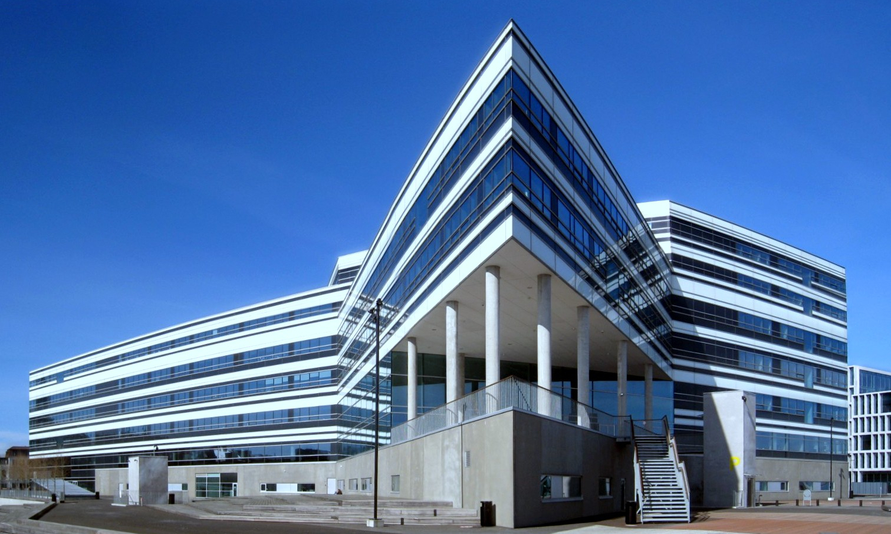

# My Latest Project

It’s this: [icdocs.ismacontrolli.com/nee/V1.1.0](https://icdocs.ismacontrolli.com/nee/V1.1.0/).

It was a huge effort to make this happen — a project that larger companies gave up on because it was too hard. And now it powers buildings such as **Navitas Park**.  

The system is built in a few main layers:

---

## Hardware Layer  
At the base lies the hardware. I was not involved in this layer at all.  

---

## Firmware / Native Code Layer  
Just above hardware is the firmware—and I did only a little work here: some consulting, tests, and guiding junior engineers when tough problems arose.  

---

## Application / User Logic Layer  
The higher-level logic is what allows users to design and run their own applications on the microcontroller (in this case a BMS device). This layer also executes and manages those user applications.  
This is where I spent most of my energy: I developed modules, shaped the architecture, and influenced the overall design. As my manager said **half of the code in framework is yours**, and I strongly influenced much of the rest.

---

## Communication / Client Layer  
On top is the proprietary protocol and client application that lets users interface with the system and build apps. My work here was more moderate: implementing communication between the client and device, helping define protocol semantics, writing few views, some fixes etc.

---

**Adam Leśniak**
