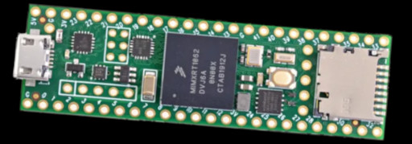
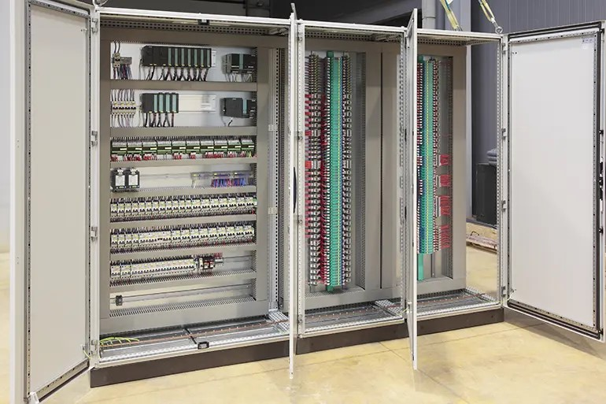
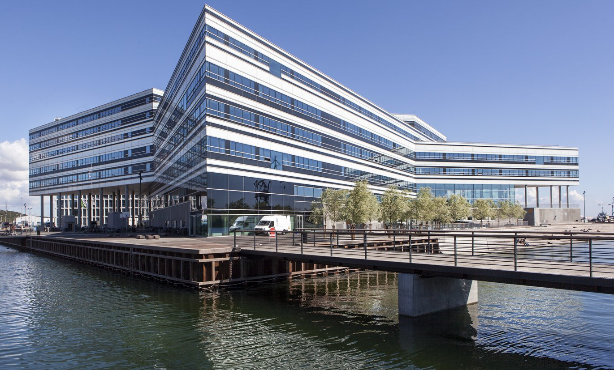

# The Next Generation of Building Controllers

## Achievement

For five years I was part of a small team with a big ambition: to design and deliver a new generation of building controllers that could set a higher standard for the industry. A few larger players had tried to bring similar systems to market without success. We managed to make it real—and now the system powers many prestigious buildings across Europe.

I was keeping the foundation of the system solid and adaptable. I designed and implemented the runtime environment that powered every controller, and I built the communication layers that allowed sensors, controllers, and actuators to speak to each other reliably. Beyond coding, I shaped the core concepts and kept the architecture simple and modular so that the system could evolve without collapsing under its own complexity.

The scope was wide—from hardware and firmware, through the framework itself, up to the client software used to program the controllers. Each layer had to be considered, aligned, and kept in sync. The challenge wasn’t trivial: these devices are meant to be buried in the basments or under the ceiling and run for 10–20 years without crashing or requiring human intervention. That meant every design choice had to prioritize stability, maintainability, and resilience in a way that would stand the test of time.

At the same time, performance demands were extreme. The embedded virtual machine had to execute complex customer logic, handle visualization, serve HTTP requests, log data, and coordinate communication with dozens or even hundreds of other devices over multiple protocols. All of this had to happen on a microcontroller with only 8 MB of RAM and no memory management unit. Making that possible required relentless optimization and architectural discipline—balancing flexibility with strict efficiency.

What made the project truly special was how much it drew from different strengths around us. Business leaders brought a strong and demanding vision. The customer support department, with its depth of experience and constant contact with real-world problems, gave insights no specification could. The engineering team added extraordinary skills and creativity. I was translating all of these perspectives into a coherent architectural frame that could hold everything together—so that vision, experience, and engineering could align with as little friction as possible.

## Technical Challenges

Over the years I wore many hats: architect, lead developer, and team lead. I made sure the vision was clear and the execution was steady. There were myriad of technical problems along the way—avoiding getters that slowed the core too much, rewriting off‑the‑shelf serial port APIs that weren’t performant enough, debugging a garbage collector, designing low‑level APIs, inventing custom serialization. These were the kinds of challenges that kept my brain in overdrive and, in a way, made the project awesome to work on. As my manager once put it, 'probably about half of the code in the framework is yours.' The most telling proof of my impact is that, after I left, the momentum slowed. This wasn’t because others lacked skill—it was because much of the connective tissue holding the project together was the result of constant, careful architectural guidance and asking beyond specification.

It was a rare project where engineering discipline, collective vision, and persistence converged.

## Looking back

Looking back, I see it as one of the most meaningful achievements of my career so far. What I learned most is that focusing on the domain—understanding business goals and real customer problems—is at least as important as technical excellence, and probably even more. Perhaps my best initiative was spending long hours in the customer support department, which allowed me to understand issues far beyond what any specification could ever capture.

When I joined the team I was already a strong developer, but only there did I truly learn what teamwork and cross‑collaboration mean. Even as a high‑level programmer, I often had to sit with hardware engineers to understand constraints, work side by side with firmware developers to achieve breakthrough results, and stay in close contact with the test department to refine quality. One‑on‑one discussions with business and support people were equally crucial. That is how something better is built—not as a lone star, but as part of a tightly connected effort.

But that’s not all. Being part of a team also means looking at the people themselves and understanding them—something no book can teach. Some developers need constant challenge or they risk boredom and stagnation, others need encouragement, and some respond best to critique. But all need to feel pride in what they do. There is no training program that can impart this instinct. Learning it firsthand was my greatest takeaway from this chapter of my career.

