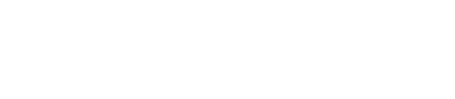

It wasn’t a big contract. More like a filler gig while I was searching for something longer-term — but the challenge sounded interesting, so I took it. It was about logic for symbolic AI for a Scrabble game on mobile with limited resources. My initial solution that was a few hours of work and just intuitive scripting of game rules ended badly — the first match against one letter on the board was taking several minutes. For a developed board, that would mean **days of computation**.

> $$
> \Large O\big(n\,b\,h\,k\,y\big)
> $$
>
> $$
> {\small
> \begin{array}{r l l}
> n & \text{: dictionary size} & \approx 5\times 10^{4}\\
> b & \text{: board positions/orientations} & \approx 2\times 10^{3}\\
> h & \text{: tiles on hand} & = 7\\
> k & \text{: board-overlap checks} & 1{-}500\\
> y & \text{: branching factor} & \approx 10
> \end{array}
> }
> $$
> 
> $$
> \;\approx\; (5\times 10^{4})(2\times 10^{3})\cdot 7 \cdot 500 \cdot 10
> = \mathbf{3.5\times 10^{12}}
> \;\;\text{string-checks on an early smartphone.}
> $$

After spending some time with the problem, a little bit of debugging and **profiling** made it clear that iterating over everything was simply a no-go. I needed a way to limit what needed checking — by a lot. So I came up with a solution that worked surprisingly well. The trick was pre-processing data so that only interesting parts were ever fed to the logic.

The problem was that on the board you look for matches with some set of letters, and you are not at all interested in words that do not contain any of those. So I **multiplied the dictionary** into 26 dictionaries — each containing only words that included a given letter and each containing all words containing that letter. Additionally, I split those words into two parts: prefix and postfix, so I could easily feed them into a comparator. The price was not only that each word appeared in multiple dictionaries but often multiple times in one dictionary. Imagine the word *“letters”* which in the “t” dictionary could be represented as *le-ters* or *let-ers*, but would also be present twice in the “e” dictionary and once in the dictionaries for “l,” “r,” and “s.”&#x20;

The performance was still not great, but it was approaching something reasonable. The last two tweaks that made it truly fast were fast pointers and multithreading. Multithreading was kind of trivial: for every query, run another task and don't await them. **Fast pointers** meant reprocessing the dictionary so each entry became a set of prefix, postfix, offset to the next meaningful change of prefix, and offset to the next meaningful change of postfix. This way, if the match was at the 1000th position in the dictionary, only a few, maybe a few dozen jumps were required instead of a thousand. And voila — it worked like a charm. I didn’t measure data growth precisely, but it had grown a lot.

### Looking Back

It wasn’t a big deal, but I still remember it fondly. Making something a **ten thousands times faster** is an achievement in my world. It was also the first time I had to look not only at the code but also at what and how was fed to it.

It was pure intuition — I just looked at the data, stayed with the problem, and eventually the idea emerged. I still have a hard time explaining how it works. I’m more of a *not-give-uper* than a Mentat, if you’ve ever read *Dune*. The way for me is  to **ingest the problem and the context**, not fast matching to pre-learned solution.
