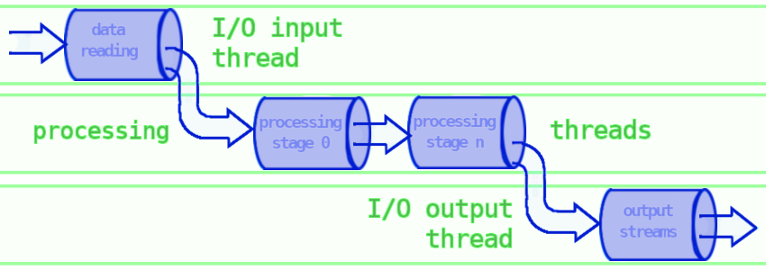

---

When I joined, the customer’s telemetry plugin was a wreck. It was supposed to stream data at 60 FPS from raw memory, but instead it crashed constantly, duplicated logic in barely tweakable ways, and hid behind hundreds of unit tests that mostly tested mocks rather than the real system. It was virtually impossible to extend, and impossible to trust.

I rebuilt it into a working pipeline.

### The rescue

Instead of patching over problems, I put structure back into the system. I designed a shared abstraction so every stage had predictable error handling, logging and data ingestion/output. I pulled apart the heavy coupling so that stages could be switched off and fail safely. One of my own additions was a dedicated stage for diverting data into separate thread, which together with one to many pipe made parallel processing possible. When needed I tweaked the connected Java backend to keep the whole flow consistent.

### Empowering developers

To make the system usable for others, I built some tools. Python scripts could fetch telemetry samples, replay them through the pipeline, and automatically compare results. Other scripts translated binary logs into clear CSVs so debugging became human‑readable. What used to take hours of manual inspection could now be done in minutes — development and testing sped up at least **3×**.

Along the way, I worked closely with the customer’s junior developers. Much of the progress happened through pair‑programming sessions where I explained design trade‑offs and showed practical debugging techniques. This not only spread knowledge of the new pipeline but also helped raise the team’s confidence and skills.

### Built to last

Finally, I added real system tests that validated the pipeline end‑to‑end, without mocks. The result was solid performance: **zero dropped frames at 60 FPS** on below‑mid‑tier PCs, even under heavy load. What I left behind was no longer a fragile prototype, but a stable, testable system ready for real evolution.

---

**Outcome:**\
A crash‑prone mess turned into a reliable, event‑driven pipeline with safe concurrency and strong tooling. What had been a liability became a foundation for future features.

---

*Personal note:* I also met there one more best engineering manager in the world.
