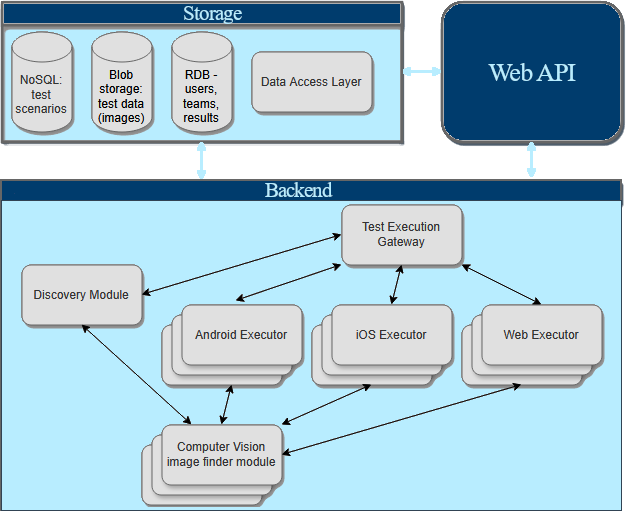
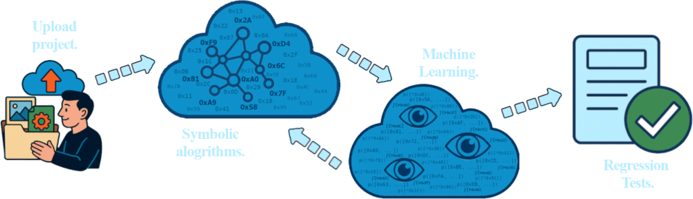

I joined this R&D project as a **Senior Algorithms Programmer**, but my role quickly expanded. The product aimed to build a SaaS platform for automated UI testing, with executors spanning iOS, Android, Windows, Web. It was funded through a national innovation grant, but ultimately discontinued after management changes.

That's a great sorrow for me as project had a great potential and was just so cool to work on... and team was great and very dedicated.

---

### Universal Data Model

I designed a **common JSON structure** that served as the backbone of the system. It was universal across engines — Selenium, Android, iOS — and directly integrated into the web UI, where customers could define and manage tests. This abstraction simplified the codebase, enabled modularization, and set the stage for future microservice separation.

### Auto-Discovery of UI Flows

I proposed and prototyped an ambitious feature: **automatic discovery of navigation paths**. Instead of manually configuring regression tests, users could upload screenshots of UI elements. An algorithm would then explore the app, build a map of screens, and generate baseline tests automatically.

The prototype worked on mock applications, proving feasibility, though performance was slow and features like Android back-button handling or swipes were missing. With optimization or scaled-out compute, the idea had strong potential to transform how UI tests are created.

### Bridging the AI Team

The computer vision team, working on image-matching with OpenCV, had stalled. Their API returned only simple results (match/no match, single coordinate). Nobody else understood their work, and they lacked guidance on what the product needed. I stepped in — clarifying requirements, aligning their outputs with our use cases, and helping them expose a proper API via Python/Flask. Together we expanded the functionality with probability scores, bounding boxes, and tolerance for scaling and rotation.

This collaboration unblocked progress and significantly improved the quality and usefulness of the vision component.

### Team & Practices

The team was small and mostly junior developers. I introduced **git flow**, **unit testing**, and better communication practices. These may sound mundane, but they were essential for stabilizing the project and making experimentation sustainable.

---

### Reflection

The project ended when the grant expired and new management adjusted priorities putting this on the back burner. It never reached wide adoption, but the **concepts and prototypes demonstrated real potential**:

- A portable architecture, able to run in Azure or on-prem.
- A universal data contract bridging engines, UI, and backend.
- Early steps toward autonomous UI test generation.

For me, it was the work I love: combine **algorithmic problem-solving, architectural foresight, and leadership in ambiguous R&D conditions.** But without support from the business division of the company no innovation can succeed.

